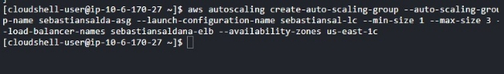

**Amazon ELB - Auto Scaling**

**Indicaciones**

1. Las respuestas deben ser explicadas, solo colocar resultados sin ninguna referencia no puntúa en las preguntas de la evaluación.
1. Realiza una copia de este documento y coloca todas tus respuestas y sube a tu repositorio personal de github en formato markdown. Presenta capturas de pantalla del procedimiento y las explicaciones necesarias. No puntúa si solo se hace la presentación de imágenes.
1. De preferencia adiciona un video adicional explicando los pasos realizados. Utiliza el sandbox de AWS usado en la práctica anterior.
1. Sube a la plataforma de Blackboard el enlace de github donde están todas tus respuestas. No olvides colocar tu nombre y apellido antes de subir el enlace de tus respuestas a la plataforma
1. Cualquier evidencia de copia elimina el examen se informará de la situación a la coordinación.

Alumno: Sebastian Antonio Saldaña Rodriguez

# **Amazon ELB**

Aquí, usamos Amazon Elastic Load Balancing (ELB) y Amazon Cloud Watch a través de la CLI de AWS para equilibrar la carga de un servidor web.

## **Parte 1: ELB**

1. Inicia sesión en el sandbox del curso AWS . Ve al directorio donde guarda el archivo de script de instalación de apache del laboratorio de la práctica calificada 3. Para crear un balanceador de carga, haz lo siguiente.

~~aws elb create-load-balancer --load-balancer-name~~ ~~tu\_nombre de usuario --oyentes~~ ~~"Protocolo=HTTP,LoadBalancerPort=80,InstanceProtocol=~~ ~~HTTP,InstancePort=80" --availability-zones us-east-1d~~

CORREGIDO:

aws elb create-load-balancer --load-balancer-name nombre

--listeners "Protocol=HTTP,LoadBalancerPort=80,InstanceProtocol=HT TP,InstancePort=80" --availability-zones us-east-1d

¿Cuál es el DNS\_Name del balanceador de carga?

1. El comando describe-load-balancers describe el estado y las propiedades de tu(s) balanceador(es) de carga. Presenta este comando.

aws elb describe-load-balancers

--load-balancer-name tu\_nombre\_de\_usuario

¿Cuál es la salida?

1. Creamos dos instancias EC2, cada una ejecutando un servidor web Apache. Emite lo siguiente.

aws ec2 run-instances --image-id ami-d9a98cb0 --count 2

--instance-type t1.micro --key-name tu\_nombre\_de\_usuario-key

--security-groups tu\_nombre\_de\_usuario

--user-data file://./apache-install --placement AvailabilityZone=us-east-1d

aws ec2 run-instances --image-id ami-d9a98cb0 --count 2 --instance-type t1.micro --key-name tu\_nombre\_de\_usuario-key --security-groups tu\_nombre\_de\_usuario --user-data file://./apache-install --placement AvailabilityZone=us-east-1d

¿Qué parte de este comando indica que deseas dos instancias EC2? ¿Qué parte de este comando garantiza que tus instancias tendrán Apache instalado? ¿Cuál es el ID de instancia de la primera instancia? ¿Cuál es el ID de instancia de la segunda instancia?

- --count 2
- --user-data file://./apache-install
- i-08c6062d8587168ca
- i-0eca58e5482addfec
1. Para usar ELB, tenemos que registrar las instancias EC2. Haz lo siguiente, donde instance1\_id e instance2\_id son los obtenidos del comando en el paso 3.

aws elb register-instances-with-load-balancer

--load-balancer-name tu\_nombre\_de\_usuario

--instances instance1\_id instancia2\_id

aws elb register-instances-with-load-balancer --load-balancer-name tu\_nombre\_de\_usuario --instances instance1\_id instancia2\_id

¿Cuál es la salida?

Ahora vea el estado de la instancia de los servidores cuya carga se equilibra. aws elb describe-instance-health

--load-balancer-name tu\_nombre\_de\_usuario

aws elb describe-instance-health --load-balancer-name tu\_nombre\_de\_usuario

¿Cuál es la salida?

1. Abre el navegador del sandox. Recupera la dirección IP de tu balanceador de carga del paso 1, ingresa la URL http://nombre\_dns\_de\_tu\_balanceador\_carga/ en tu navegador web. ¿Qué apareció en el navegador?

1. Abre dos ventanas de terminal adicionales y ssh en ambos servidores web. En cada uno, cd al directorio DocumentRoot (probablemente /usr/local/apache/htdocs) y modifique la página de inicio predeterminada, index.html, de la siguiente manera.

<html><body><h1>¡Funciona!</h1>

La solicitud se envió a la instancia 1.

La solicitud fue atendida por el servidor web 1.

</body></html>

Para el segundo servidor, haz lo mismo excepto que use la instancia 2 y el servidor 2 para las líneas 2 y 3. En el navegador web, accede a tu balanceador de carga 4 veces (actualícelo/recárgalo 4 veces).

Esto genera 4 solicitudes a tu balanceador de carga.

¿Cuántas solicitudes atendió el servidor web 1?

- 2

¿Cuántas solicitudes atendió el servidor web 2?

- 2

## **Parte 2: CloudWatch**

1. CloudWatch se utiliza para monitorear instancias. En este caso, queremos monitorear los dos servidores web. Inicia CloudWatch de la siguiente manera.

aws ec2 monitor-instances

--instance-ids instance1\_id instance2\_id

aws ec2 monitor-instances --instance-ids instance1\_id instance2\_id

¿Cuál es la salida?

Ahora examina las métricas disponibles con lo siguiente: aws cloudwatch list-metrics --namespaces "AWS/EC2"

aws cloudwatch list-metrics --namespaces "AWS/EC2"

¿Viste la métrica CPUUtilization en el resultado?

1. Ahora configuramos una métrica para recopilar la utilización de la CPU. Obtener la hora actual con date -u. Esta será tu hora de inicio. Tu hora de finalización debe ser 30 minutos más tarde. Haz lo siguiente.

aws cloudwatch get-metric-statistics

--metric-name CPUUtilization

--start-time your\_start\_time --end-time

your\_end\_time --period 3600 --namespace AWS/EC2

--statistics Maximum

– dimensions Name=InstanceId,Value=instance2\_id

aws cloudwatch get-metric-statistics --metric-name CPUUtilization --start-time your\_start\_time --end-time your\_end\_time --period 3600 --namespace AWS/EC2

--statistics Maximum --dimensions Name=InstanceId,Value=instance2\_id

¿Cuál es la salida?

1. Apache tiene un herramienta benchmark llamada ab. Si desea ver más información sobre ab, consulte [http://httpd.apache.org/docs/2.0/programs/ab.html.](http://httpd.apache.org/docs/2.0/programs/ab.html) Para ejecutar ab, emita el siguiente comando en tu sistema de trabajo.

ab -n 50 -c 5 http://nombre\_dns\_de\_tu\_balanceador\_carga/

ab -n 50 -c 5 http://nombre\_dns\_de\_tu\_balanceador\_carga

¿Qué significan -n 50 y -c 5?

0. "-n 50": Esto indica el número total de solicitudes que se realizarán al servidor. En este caso, se están enviando 50 solicitudes.
0. "-c 5": Esto establece el número de solicitudes concurrentes que se enviarán al servidor al mismo tiempo. En este caso, se están enviando 5 solicitudes simultáneamente.

¿Cuál es la salida?.

1. Ahora queremos examinar la métrica de latencia del ELB. Utiliza el siguiente comando con las mismas horas de inicio y finalización que especificó en el paso 8.

aws cloudwatch get-metric-statistics --metric-name Latency

--start-time your\_start\_time --end-time your\_end\_time --period 3600 --namespace AWS/ELB

--statistics Maximum --dimensions Name=LoadBalancerName,Value=tu\_nombre\_de\_usuario

aws cloudwatch get-metric-statistics --metric-name Latency --start-time your\_start\_time

--end-time your\_end\_time --period 3600 --namespace AWS/ELB --statistics Maximum

--dimensions Name=LoadBalancerName,Value=tu\_nombre\_de\_usuario

aws cloudwatch get-metric-statistics --metric-name

RequestCount --start-time your\_start\_time --end-time your\_end\_time --period 3600

--namespace AWS/ELB

--statistics Sum --dimensions Name=LoadBalancerName,Value=tu\_nombre\_de\_usuario

aws cloudwatch get-metric-statistics --metric-name RequestCount --start-time your\_start\_time --end-time your\_end\_time --period 3600 --namespace AWS/ELB

--statistics Sum --dimensions Name=LoadBalancerName,Value=tu\_nombre\_de\_usuario

## **Parte 3: Limpieza**

1. Necesitamos cancelar el registro de las instancias de ELB. Haz lo siguiente. aws elb deregister-instances-from-load-balancer

--load-balancer-name tu\_nombre\_de\_usuario

--instances instance1\_id instance2\_id

aws elb deregister-instances-from-load-balancer --load-balancer-name tu\_nombre\_de\_usuario --instances instance1\_id instance2\_id

¿Cuál es la salida?

1. A continuación, eliminamos la instancia de ELB de la siguiente manera. aws elb delete-load-balancer --load-balancer-name

tu\_nombre\_de\_usuario

aws elb delete-load-balancer --load-balancer-name tu\_nombre\_de\_usuario

Finalmente, finaliza las instancias del servidor web de tus instancias y tu instancia EC2.

¿Qué comandos usaste?

0. Finalizar las instancias del servidor web:

   0. aws ec2 terminate-instances --instance-ids i-08c6062d8587168ca i-0eca58e5482addfec

¿Cuál es la salida?

# **Auto Scaling**

Usamos AWS CLI para configurar sus instancias EC2 para el escalado automático.

## **Parte 1: escalar hacia arriba**

1. Inicia sesión en el sandbox virtual. Cambia al directorio donde guarda el archivo de script de instalación de apache. Inicie una instancia de la siguiente manera.

aws autoscaling create-launch-configuration

--launch-configuration-name *tu\_nombre\_de\_usuario*-lc

--image-id ami-d9a98cb0 --instance-type t1.micro

--key-name *tu\_nombre\_usuario*-key --security-groups

*tu\_nombre\_usuario* --user-data file://./apache-install

aws autoscaling create-launch-configuration --launch-configuration-name tu\_nombre\_de\_usuario-lc --image-id ami-d9a98cb0 --instance-type t1.micro --key-name tu\_nombre\_usuario-key --security-groups tu\_nombre\_usuario --user-data

file://./apache-install

¿Cuál es la salida?

A continuación, crea un equilibrador de carga. aws elb create-load-balancer --load-balancer-name

tu\_nombre\_de\_usuario-elb --listeners "Protocol=HTTP, LoadBalancerPort=80, InstanceProtocol=HTTP,InstancePort=80"

– availability-zones us-east-1c

aws elb create-load-balancer --load-balancer-name tu\_nombre\_de\_usuario-elb

--listeners "Protocol=HTTP, LoadBalancerPort=80, InstanceProtocol=HTTP,InstancePort=80" --availability-zones us-east-1c

¿Cuál es la salida?

1. Ahora creamos un grupo de escalado automático. Haz lo siguiente. aws autoscaling create-auto-scaling-group

--auto-scaling-group-name tu\_nombre\_de\_usuario-asg

--launch-configuration-name tu\_nombre\_de\_usuario-lc

--min-size 1 --max-size 3 --load-balancer-names tu\_nombre\_de\_usuario-elb --availability-zones

us-east-1c

aws autoscaling create-auto-scaling-group

--auto-scaling-group-name tu\_nombre\_de\_usuario-asg

--launch-configuration-name tu\_nombre\_de\_usuario-lc

--min-size 1 --max-size 3 --load-balancer-names tu\_nombre\_de\_usuario-elb --availability-zones us-east-1c

¿Cuál es la salida?

1. Para describir el grupo de escalado automático que acabas de crear, emite el siguiente comando.

aws autoscaling describe-auto-scaling-groups

--auto-scaling-group-name tu\_nombre\_de\_usuario-asg

aws autoscaling describe-auto-scaling-groups --auto-scaling-group-name tu\_nombre\_de\_usuario-asg

¿Cuál es la salida?

Deberías ver que se crea una nueva instancia EC2. Si no lo ves, espera 2 minutos y vuelve a ejecutar el comando.

¿Cuál es el ID de la instancia? i-03193c8a55d8579ee

1. Ahora creamos una política de escalado hacía arriba seguida de una alarma de CloudWatch para determinar, en caso de que lapolítica sea cierta, que AWS necesita

ampliar nuestros recursos. Escribe los dos comandos que siguen. AnotA el valor de PolicyARN del primer comando.

aws autoscaling put-scaling-policy

--auto-scaling-group-name tu\_nombre\_de\_usuario-asg

--policy-name tu\_nombre\_de\_usuario-scaleup

--scaling-adjustment 1

--adjustment-type ChangeInCapacity --cooldown 120

aws autoscaling put-scaling-policy --auto-scaling-group-name tu\_nombre\_de\_usuario-asg --policy-name tu\_nombre\_de\_usuario-scaleup

--scaling-adjustment 1 --adjustment-type ChangeInCapacity --cooldown 120

aws cloudwatch put-metric-alarm --alarm-name tu\_nombre\_de\_usuario-highcpualarm

--metric-name CPUUtilization --namespace AWS/EC2

--statistic Average --period 120 --threshold 70

--comparison-operator GreaterThanThreshold

--dimensions "Name=AutoScalingGroupName,Value= tu\_nombre\_de\_usuario-asg" --evaluation-periods 1

--alarm-actions value\_of\_PolicyARN

aws cloudwatch put-metric-alarm --alarm-name tu\_nombre\_de\_usuario-highcpualarm

--metric-name CPUUtilization --namespace AWS/EC2 --statistic Average --period 120

--threshold 70 --comparison-operator GreaterThanThreshold --dimensions "Name=AutoScalingGroupName,Value= tu\_nombre\_de\_usuario-asg"

--evaluation-periods 1 --alarm-actions value\_of\_PolicyARN

¿Cuál es la salida de ambos comandos?

¿Cuál es el valor de PolicyARN? (El valor es una cadena larga sin comillas).

arn:aws:autoscaling:us-east-1:903131493500:scalingPolicy:ada4846d-c1d5-4202-97 9f-46289a66c12f:autoScalingGroupName/sebastiansalda-asg:policyName/sebassa-s caleup

Ejecuta el siguiente comando para ver una descripción de tu alarma. aws cloudwatch describe-alarms

--alarm-names

tu\_nombre\_de\_usuario-highcpualarm

aws cloudwatch describe-alarms

--alarm-names tu\_nombre\_de\_usuario-highcpualarm

¿Cuál es la salida?

1. Inicia sesión en la instancia EC2 desde el paso 1 mediante ssh. Cambia al root. Cargaremos y ejecutaremos una herramienta stress para aumentar la utilización de procesamiento del servidor. Emite los siguientes comandos de Linux.

apt-get install stress stress--cpu 1

Inicia un nuevo terminal. Repite el siguiente comando cada 2 minutos hasta que veas la segunda instancia EC2 y luego una tercera instancia EC2. En este punto, emite las siguientes instrucciones en la ventana de tu terminal inicial.

aws autoscaling describe-auto-scaling-groups

--auto-scaling-group-name tu\_nombre\_de\_usuario -asg

aws autoscaling describe-auto-scaling-groups --auto-scaling-group-name sebastiansalda-asg

¿Cuál es la salida?

## **Parte 2: reducir la escala**

1. Ahora exploraremos cómo AWS puede controlar el escalado hacia abajo mediante la eliminación de algunas de las máquinas virtuales creadas. Ejecuta los siguientes dos

comandos, nuevamente tomando nota del PolicyARN creado a partir del primer comando para usar en el segundo.

aws autoscaling put-scaling-policy

--auto-scaling-group-name tu\_nombre\_de\_usuario-asg

--policy-name tu\_nombre\_de\_usuario-scaledown

--scaling-adjustment -1 --adjustment-type

ChangeInCapacity --cooldown 120

aws autoscaling put-scaling-policy --auto-scaling-group-name sebastiansal-asg

--policy-name sebastianrodri-scaledown --scaling-adjustment -1 --adjustment-type ChangeInCapacity --cooldown 120

aws cloudwatch put-metric-alarm

--alarm-name tu\_nombre\_de\_usuario-lowcpualarm

--metric-name CPUUtilization --namespace AWS/EC2

--statistic Average --period 120 --threshold 30

--comparison-operator LessThanThreshold --dimensions "Name=AutoScalingGroupName,Value=tu\_nombre\_de\_usuario-asg "

--evaluation-periods 1 --alarm-actions value\_of\_PolicyARN

aws cloudwatch put-metric-alarm --alarm-name sebasrodri-lowcpualarm --metric-name CPUUtilization

--namespace AWS/EC2 --statistic Average --period 120

--threshold 30 --comparison-operator LessThanThreshold

--dimensions "Name=AutoScalingGroupName,Value=sebastiansalda-asg"

--evaluation-periods 1 --alarm-actions value\_of\_PolicyARN

¿Cuáles son las salidas?

¿Cuál es el valor de PolicyARN?

- arn:aws:autoscaling:us-east-1:903131493500:scalingPolicy:8907534d-eae7-476e

-9204-8c237708b1fa:autoScalingGroupName/sebastiansalda-asg:policyName/se bastianrodri-scaledown

1. Cambia al terminal de la instancia EC2. Escribe ctrl+c para detener el comando stress. Vuelva a la ventana del terminal y repite el siguiente comando cada 2 minutos hasta que vea solo un EC2 en su grupo de escalado automático.

aws autoscaling describe-auto-scaling-groups

--auto-scaling-group-name tu\_nombre\_de\_usuario-asg

aws autoscaling describe-auto-scaling-groups --auto-scaling-group-name sebastiansalda-asg

¿Cuál es la salida?

Efectivamente solo me aparece una instancia.

## **Parte 3: Limpieza**

1. Elimina el grupo de escalado automático mediante el siguiente comando. Si el grupo tiene instancias o actividades de escalado en curso, debes especificar la opción para forzar la eliminación para que se realice correctamente. Si el grupo tiene políticas, al eliminar el grupo se eliminan las políticas, las acciones de alarma subyacentes y cualquier alarma que ya no tenga una acción asociada. Después de eliminar tu grupo de escala, elimina tus alarmas como se muestra a continuación.

aws autoscaling delete-auto-scaling-group

--auto-scaling-group-name tu\_nombre\_de\_usuario-asg

--force-delete

aws autoscaling delete-auto-scaling-group

--auto-scaling-group-name sebastiansalda-asg --force-delete

aws cloudwatch delete-alarms

--alarm-name tu\_nombre\_de\_usuario-lowcpualarm

aws cloudwatch delete-alarms

--alarm-names sebasrodri-lowcpualarm

¿Cuál es la salida?

aws cloudwatch delete-alarms --alarm-name

tu\_nombre\_de\_usuario-highcpualarm

aws cloudwatch delete-alarms --alarm-names sebassal-highcpualarm

¿Cuál es la salida?

Elimina tu configuración de lanzamiento de la siguiente manera. aws autoescaling delete-launch-configuration

--launch-configuration-name tu\_nombre\_de\_usuario-lc

aws autoscaling delete-launch-configuration

--launch-configuration-name sebastiansal-lc

¿Cuál es la salida?

Finalmente, elimina tu ELB.

¿Qué comando ejecutaste?.

- aws elb delete-load-balancer --load-balancer-name sebastiansaldana-elb

